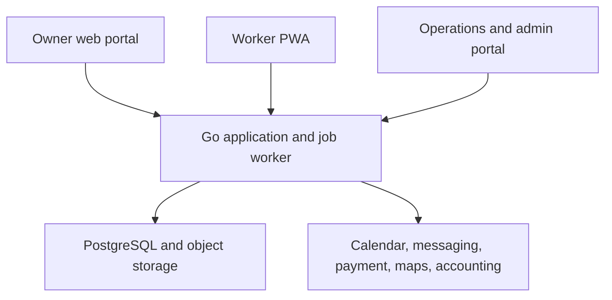
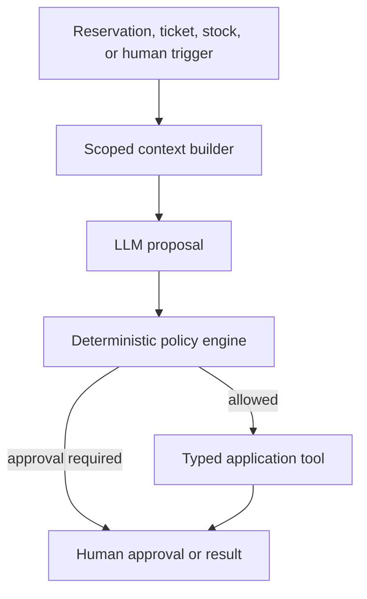
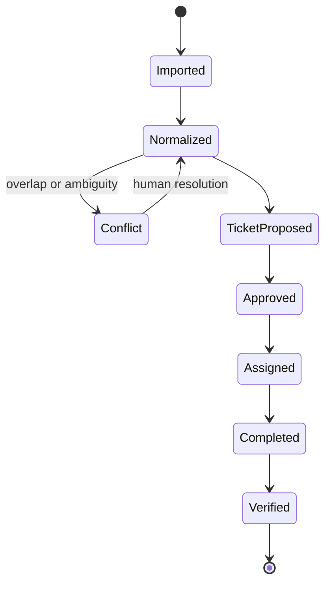

# Comfort Curators Technical Architecture

Version: 0.1  
Architecture style: Go modular monolith with property-scoped automation  
Initial scale: 5-property pilot, then 30 properties  
Long-range design target: up to 10,000 properties without a mandatory microservice rewrite

## 1. Architecture decision

Build a modular monolith in Go backed by PostgreSQL and object storage.

This is not a single undifferentiated codebase. Each business capability owns its models, commands, queries, policies, and events. Modules communicate through explicit application interfaces and durable domain events. One deployable API and one background-worker deployable keep operations simple while the business model is still changing.

Do not create a microservice per property, per Jarvis, or per business noun. At 30 properties, distributed-service overhead would be a larger risk than application throughput.

## 2. System context



The worker interface should be a progressive web application first. It must support low-bandwidth task lists, local checklist progress, queued evidence upload, and visible synchronization status. Native applications can be considered only if background location, camera, and offline requirements cannot be met safely.

## 3. Runtime topology

### Deployables

1. `api`: authenticated HTTP API, owner portal backend, worker backend, admin backend, and webhooks.
2. `worker`: calendar polling, scheduled workflows, notification delivery, document processing, inventory forecasts, exports, and Jarvis jobs.
3. `web`: static or server-rendered frontends for owner, worker, and staff experiences.

The API and worker use the same modules and contracts but run different entry points. Both may be horizontally replicated.

### Data services

- PostgreSQL: transactional system of record.
- Object storage: documents, photos, evidence, invoices, and exports.
- Secrets manager: encryption keys and external credentials.
- Email, SMS, or messaging provider: transactional delivery.
- Observability service: logs, metrics, traces, and alerts.

Avoid a mandatory Redis or separate message broker in the first release. Use PostgreSQL-backed jobs and a transactional outbox. Add a cache or broker only after measured contention or latency requires it.

## 4. Module map

| Module | Owns | Must not own |
| --- | --- | --- |
| Identity and Access | users, organizations, roles, sessions, MFA, support access | property business rules |
| Tenancy | tenants, memberships, service regions | user passwords or worker payroll |
| Properties | properties, rooms, access policy, compliance status, service configuration | reservation ingestion |
| Reservations | external calendars, normalized reservations, conflicts, feed health | turnover completion |
| Tickets | ticket lifecycle, checklists, evidence requirements, incidents | worker employment terms |
| Dispatch | availability, assignment, routes, time windows, workload limits | payroll posting |
| Workforce | employee and vendor profiles, agreements, skills, training, time records, grievances | owner billing |
| Fleet | e-bikes, batteries, custody, inspections, maintenance, incidents | route pricing |
| Catalog and Packages | SKUs, bundles, property package versions, substitutions, sponsorship labels | physical stock balance |
| Inventory | stock locations, movement ledger, counts, reorder proposals | supplier payment |
| Procurement | suppliers, quotes, requisitions, purchase orders, receiving | final accounting books |
| Documents | files, versions, extracted fields, expiry, reviews, submission packets | legal certification |
| Billing | contracts, fee rules, charges, invoices, credits, operational subledger | bank payment release |
| Finance Controls | maker-checker approvals, exports, reconciliation exceptions | statutory audit opinion |
| Communications | templates, preferences, delivery, conversation links | ticket state authority |
| Jarvis | property-scoped reasoning, tool selection, proposals, summaries | raw database access or policy authority |
| Audit and Compliance | append-only audit events, policy decisions, retention, access review | mutable source records |
| Reporting | operational read models and metrics | authoritative transaction writes |

Each module exposes an application service interface. Other modules do not write its tables directly.

## 5. Repository structure

```text
/cmd/api
/cmd/worker
/internal/platform
  /auth
  /database
  /jobs
  /events
  /files
  /observability
  /policy
/internal/modules
  /identity
  /tenancy
  /properties
  /reservations
  /tickets
  /dispatch
  /workforce
  /fleet
  /catalog
  /inventory
  /procurement
  /documents
  /billing
  /finance
  /communications
  /jarvis
  /audit
  /reporting
/migrations
/web
/tests
```

Inside each module, prefer:

```text
/domain
/application
/ports
/adapters
/queries
```

Do not build a generic framework for every module. The boundary matters more than identical folder ceremony.

## 6. Core data model

### Identity and tenancy

- `tenants`
- `users`
- `tenant_memberships`
- `roles`
- `role_permissions`
- `support_access_grants`
- `sessions`
- `mfa_methods`

### Properties and reservations

- `properties`
- `property_units`
- `property_access_policies`
- `property_access_secrets`
- `property_compliance_items`
- `calendar_feeds`
- `external_calendar_events`
- `reservations`
- `reservation_conflicts`

### Tickets and evidence

- `tickets`
- `ticket_state_events`
- `ticket_assignments`
- `checklist_templates`
- `ticket_checklist_items`
- `evidence_files`
- `incidents`
- `escalations`

### Workforce and fleet

- `workers`
- `employment_terms`
- `vendor_profiles`
- `skills`
- `worker_skills`
- `training_records`
- `availability_windows`
- `time_entries`
- `expenses`
- `grievances`
- `adverse_action_reviews`
- `fleet_assets`
- `fleet_batteries`
- `fleet_custody_events`
- `fleet_inspections`
- `fleet_maintenance`

### Catalog, inventory, and procurement

- `catalog_items`
- `catalog_claim_evidence`
- `package_templates`
- `property_package_versions`
- `property_package_items`
- `stock_locations`
- `inventory_movements`
- `inventory_counts`
- `reorder_policies`
- `reorder_proposals`
- `suppliers`
- `supplier_items`
- `requisitions`
- `requisition_approvals`
- `purchase_orders`
- `goods_receipts`
- `supplier_rebates`

### Documents, billing, and audit

- `documents`
- `document_versions`
- `document_extractions`
- `document_reviews`
- `submission_packets`
- `service_contracts`
- `fee_rules`
- `charges`
- `invoices`
- `invoice_lines`
- `credits`
- `financial_approvals`
- `accounting_exports`
- `audit_events`
- `outbox_events`
- `job_runs`
- `ai_runs`
- `ai_tool_calls`
- `policy_decisions`

### Data constraints

- Primary business tables use stable UUID or sortable unique identifiers.
- Tenant-scoped unique indexes include `tenant_id`.
- Property-scoped foreign keys must resolve within the same tenant.
- Money uses integer minor units plus ISO currency, never floating point.
- Timestamps are stored in UTC and rendered in property timezone.
- Operational records use status and version columns, not deletion.
- Sensitive access material is separately encrypted and excluded from general queries.
- Inventory balance is computed from the ledger or maintained as a transactionally updated projection that can be rebuilt.

## 7. Authorization model

Use role-based access for broad permissions and attribute checks for tenant, property, assignment, time window, ticket state, risk class, and monetary threshold.

Authorization decision inputs:

- authenticated user or service identity;
- tenant membership;
- role and explicit permissions;
- property assignment;
- worker or vendor relationship;
- ticket state and assignment;
- service window;
- risk classification;
- approval threshold; and
- support access grant.

Every application service performs authorization. UI visibility is not enforcement.

For high-risk reads such as door codes, the service should require:

1. active assignment;
2. correct property;
3. allowed time window;
4. worker training and status;
5. no unresolved access hold; and
6. an audit event.

## 8. Jarvis architecture

### Logical instance model

“One Jarvis per property” means every run has a property-scoped context and memory boundary. It does not mean a permanent process or model copy for each property.



### Components

1. Trigger receiver: creates a durable Jarvis job with correlation ID.
2. Context builder: retrieves the minimum authorized property, reservation, ticket, inventory, and policy facts.
3. Model adapter: sends a structured request to the approved model.
4. Tool registry: exposes typed tools such as `propose_ticket`, `request_approval`, and `query_property_stock`.
5. Policy engine: validates scope, state, amount, risk, actor, and approval requirements.
6. Application service: performs the transaction and emits events.
7. Audit recorder: stores model version, policy outcome, tool name, redacted arguments, result, and correlation.
8. Human review queue: presents proposals and exceptions with evidence.

### Tool design

Jarvis tools should be narrow commands, not SQL or generic HTTP:

- `get_property_operating_summary(property_id)`
- `get_reservation_change(reservation_id)`
- `propose_turnover_ticket(reservation_id, checklist_version)`
- `propose_restock(property_id, package_version)`
- `request_owner_approval(subject_type, subject_id, reason)`
- `send_approved_notification(template_id, recipient_id, variables)`
- `assemble_document_packet(checklist_id)`
- `escalate_exception(exception_type, severity, summary)`

Each tool derives `tenant_id` and allowed `property_id` from the authenticated run context. The model does not choose an arbitrary tenant.

### Jarvis state

Persist structured operational memory, not unrestricted chat history:

- property preferences and approved package version;
- notification and approval thresholds;
- unresolved exceptions;
- recent relevant ticket summaries;
- approved substitutions;
- known access and service constraints; and
- source and effective date for every fact.

Do not store model-generated conclusions as facts without a source and confirmation status.

### Failure behavior

- If an external tool times out, return `unknown`, not success.
- If calendar facts conflict, create a reservation exception.
- If a tool is retried, use the same idempotency key.
- If policy denies an action, record the denial and offer the permitted escalation path.
- If the model is unavailable, deterministic scheduling and manual operations continue.
- Jarvis is never the only way to create, assign, approve, or close work.

## 9. Reservation-to-turnover workflow



Process:

1. Poll iCalendar feed and store raw external event.
2. Normalize dates, source ID, status, and property.
3. Match by source and external ID.
4. Detect update, cancellation, duplicate, overlap, and turnaround risk.
5. Emit `ReservationChanged` after transaction commit.
6. Jarvis or deterministic rule proposes turnover ticket.
7. Ticket policy selects checklist version and approval rule.
8. Dispatch proposes assignment based on route, availability, skill, and hours.
9. Worker receives limited property data and timed access.
10. Evidence and checklist are synchronized.
11. Independent verification closes the ticket or creates rework.
12. Ticket evidence generates billable charges and stock consumption.

## 10. Inventory and ordering workflow

1. Package version defines expected per-stay or per-period consumption.
2. Verified ticket posts property consumption movements.
3. Counts and receipts correct the ledger through documented adjustments.
4. Forecast job calculates reorder proposals.
5. Jarvis summarizes exceptional demand or substitution conflicts.
6. Inventory coordinator reviews quantity and supplier.
7. Approval policy checks owner budget, central budget, new supplier, and price variance.
8. Approved requisition creates purchase order.
9. Goods receipt posts stock and matches delivery evidence.
10. Finance export links supplier invoice, purchase order, receipt, and approval.

No single actor or AI run may create a supplier, approve an order, receive goods, and approve payment.

## 11. Event and job architecture

### Transactional outbox

When a module changes state and other work must follow, it writes the state and an `outbox_events` row in one database transaction. A worker claims and publishes or processes the event.

Example events:

- `ReservationChanged`
- `TicketApproved`
- `TicketAssigned`
- `TicketEvidenceSubmitted`
- `TicketVerified`
- `InventoryConsumed`
- `ReorderProposalCreated`
- `PurchaseOrderApproved`
- `DocumentExpiring`
- `InvoiceIssued`
- `AccessHoldCreated`
- `FleetIncidentReported`

### Job rules

- Every job has a unique idempotency key.
- A job records attempt, next attempt, lease, error class, and terminal status.
- Retries use bounded exponential backoff.
- Permanent validation failures go to a review queue, not endless retry.
- External callbacks and webhooks are authenticated and idempotent.
- Operators can replay safe events with recorded reason and scope.

## 12. API design

Use versioned REST endpoints with JSON and explicit commands. REST fits the permission-heavy workflow and makes auditing easier than exposing a broad query language.

Examples:

```text
POST /v1/properties/{property_id}/calendar-feeds
GET  /v1/properties/{property_id}/reservations
POST /v1/tickets
POST /v1/tickets/{ticket_id}/transitions
POST /v1/tickets/{ticket_id}/assignments
POST /v1/tickets/{ticket_id}/evidence
POST /v1/inventory/movements
POST /v1/reorder-proposals/{id}/approvals
POST /v1/documents/{id}/reviews
POST /v1/jarvis/runs
GET  /v1/audit-events?property_id=...
```

Rules:

- Use idempotency keys on create and transition commands.
- Return stable error codes and human-readable messages.
- Use optimistic version checks on mutable aggregates.
- Paginate all collections.
- Use signed, short-lived object upload and download grants.
- Never return access secrets in general property payloads.

## 13. File and evidence handling

- Client requests an upload grant for a specific record and file class.
- Server validates authorization, size, type, and retention class.
- Client uploads directly to object storage using a short-lived grant.
- Server records checksum, scan status, source, and object key.
- Antivirus and content validation run asynchronously before general availability.
- Images may be resized for normal viewing, but original evidence is retained according to policy.
- Sensitive identity and access files use separate storage prefixes and permissions.
- Evidence links are immutable; corrections create a superseding record.

## 14. Privacy and data lifecycle

Maintain a data inventory with:

- data field or file class;
- purpose;
- data principal;
- source;
- legal or operational basis;
- processor and storage region;
- roles allowed;
- retention period;
- deletion or anonymization behavior; and
- incident severity.

Recommended boundaries:

- Guest data: retain only what operations and law require, not full platform profiles.
- Aadhaar: prefer a verification result and masked reference; never store biometrics.
- Location: retain task-route evidence for a limited operational period, then aggregate or delete unless incident retention applies.
- Property access: rotate or revoke when assignment or contract ends.
- Model data: do not use production personal data for training by default.

DPDP rights and grievance workflows should be implemented before their broadest statutory commencement rather than deferred [S6].

## 15. Security architecture

### Identity

- Passwordless or strong password authentication with secure recovery.
- MFA for privileged and financial roles.
- Short session lifetime for privileged operations.
- Device and session revocation.
- Separate service identities for jobs and integrations.

### Application

- Central policy checks in application services.
- Server-side tenant and property filtering.
- Input validation and output encoding.
- CSRF protection for cookie sessions.
- Rate limiting and abuse controls.
- Signed webhooks and replay prevention.
- Dependency and container scanning.

### Data

- TLS in transit.
- Database and object-storage encryption at rest.
- Field-level encryption for access secrets, bank details, and selected identity fields.
- Managed key rotation and separation from application source.
- Encrypted backups and tested restore.
- Production access through approved, logged channels.

### Operations

- Structured logs without raw secrets or identity documents.
- Security-event alerts for cross-tenant denial, repeated access-secret reads, privilege change, bank-detail change, and unusual export.
- Incident response contact and CERT-In reporting playbook. CERT-In directions require covered entities to report specified incidents within six hours and maintain applicable logs for a rolling 180 days within India [S13].
- Quarterly access review at launch, increasing with scale.

## 16. Observability and service levels

### Technical metrics

- API request rate, error rate, and latency.
- database pool and slow queries.
- outbox lag and job age.
- calendar feed freshness.
- notification delay and failure.
- file scan and processing delay.
- AI tool denial, failure, and review rate.
- cross-tenant authorization denials.

### Business metrics

- upcoming arrivals without verified turnover.
- assignment fill rate.
- first-pass quality.
- rework and exception cost.
- stockout and inventory variance.
- owner approval latency.
- worker paid and unpaid time anomalies.
- contribution per property.

Alerts should describe the business effect. “Three arrivals in 12 hours lack assigned turnover” is more actionable than “queue depth 28.”

## 17. Backup and continuity

Pilot targets:

- PostgreSQL point-in-time recovery.
- Daily encrypted backup plus continuous log archiving.
- Object versioning or equivalent protection for evidence.
- Documented restore test before the 15-property gate.
- Target recovery point of 15 minutes for transactional data.
- Target recovery time of 4 hours for core operations.
- Printed or offline emergency access and owner-contact procedure for platform outage.

Jarvis outage must not stop manual task creation, assignment, access control, or incident response.

## 18. Testing strategy

### Unit tests

- ticket state transitions;
- fee rules;
- wage and assignment constraints;
- reorder calculations;
- authorization policies;
- Jarvis action policies; and
- tax-class mapping validation.

### Integration tests

- tenant isolation at repository and API levels;
- outbox transaction and replay;
- iCalendar import, update, cancel, and duplicate;
- object upload and scan;
- accounting export;
- notification delivery and retry; and
- worker offline synchronization.

### Property-based tests

- inventory ledger never creates unexplained balance;
- money totals reconcile in minor units;
- idempotent commands do not duplicate state;
- invalid ticket transitions are always rejected; and
- one tenant never resolves another tenant’s identifier.

### AI evaluation

Create a fixed evaluation set containing:

- ambiguous calendar changes;
- conflicting property rules;
- insufficient stock evidence;
- over-budget purchase request;
- prohibited worker action;
- prompt injection inside documents or messages;
- cross-property data request;
- low-confidence document extraction;
- external tool timeout; and
- adversarial request to delete evidence.

Measure tool selection, policy denial, escalation, unsupported claim, and human edit rate. A fluent answer without a valid tool outcome counts as failure.

## 19. Delivery sequence

### Phase A: operational spine

- identity, tenancy, and properties;
- reservations and iCalendar;
- tickets and checklists;
- worker assignments and timed property access;
- basic owner and worker interfaces;
- audit events and notifications.

Exit: five-property pilot can run without Jarvis.

### Phase B: controlled Jarvis

- property context builder;
- proposed turnover tickets;
- exception summaries;
- approval requests;
- tool and policy audit;
- evaluation harness.

Exit: Jarvis actions remain proposals or low-risk, code-approved operations.

### Phase C: packages and micro-inventory

- catalog and packages;
- stock movement ledger;
- consumption from verified tickets;
- reorder proposals;
- procurement approval and receiving;
- owner budget and substitution rules.

Exit: 15-property launch with measured stock accuracy.

### Phase D: billing and finance controls

- service contracts and fee rules;
- task and goods charges;
- owner invoice evidence;
- maker-checker approvals;
- accounting exports;
- property contribution reporting.

Exit: month-end close can be completed with traceable support.

### Phase E: deferred expansions

Only after separate gates:

- public specialist marketplace;
- sponsored catalog;
- external bookkeeping support;
- voluntary worker bike ownership;
- youth apprenticeship program; and
- direct fleet import.

## 20. Architecture decision records

### ADR-001: Modular monolith

Accepted. Business boundaries are modular; deployment remains simple. Split a module only after independent scaling, regulatory isolation, or team ownership is demonstrated.

### ADR-002: PostgreSQL as transactional system of record

Accepted. The workload is relational, permission-heavy, and audit-heavy. PostgreSQL also supports the first job and outbox implementation.

### ADR-003: REST command API

Accepted. Explicit resource and transition endpoints support authorization, validation, and audit better than a broad client-selected mutation surface.

### ADR-004: Jarvis is property-scoped and advisory

Accepted. Code enforces authority. The model proposes; policy and application services decide.

### ADR-005: No hard delete for operational records

Accepted. Use cancellation, reversal, expiry, supersession, and retention workflows.

### ADR-006: Inventory uses a movement ledger

Accepted. Physical stock disputes require a reconstructable history.

### ADR-007: Transactional outbox before external broker

Accepted. It prevents lost follow-up work without early distributed infrastructure.

### ADR-008: iCalendar ingestion is read-only in MVP

Accepted. External calendar mutation is a later integration with separate provider permissions and conflict handling.

### ADR-009: Core field workforce is not implemented as a generic gig marketplace

Accepted. Employment and vendor models remain explicit in both domain and UI.

### ADR-010: Finance and regulated documents require human authority

Accepted. AI may prepare, compare, and flag but does not release money, certify, sign, or file by itself.

## 21. When to split services

Consider extracting a module only if at least one is true:

- it requires materially different regulatory or data residency isolation;
- its traffic or compute profile cannot be scaled economically with the application;
- it has a stable contract and an independent team;
- failure isolation cannot be achieved inside the deployment; or
- a partner-facing interface requires separate lifecycle and security controls.

Likely future candidates are document processing, communication delivery, optimization, and analytics. Ticketing, properties, reservations, access, and billing should remain together longer because their transactional consistency matters.

## 22. Final technical judgment

The architecture can support the planned business and the long-range 10,000-property ceiling without microservices. The difficult parts are not request throughput. They are property isolation, access security, worker classification, auditable workflows, calendar ambiguity, inventory reconciliation, and preventing AI from acting beyond evidence and authority. The design prioritizes those risks.


